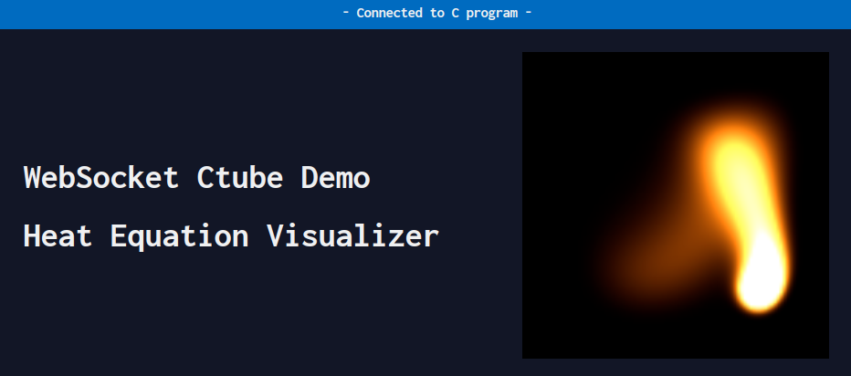

# WebSocket Ctube
`websocket_ctube` is a barebones, header-only library to make it easy for a high
performance C/C++ program to share its data with webpages while actively running
(it implements a simple non-blocking WebSocket broadcast server in C).

Modern web technology can then be harnessed to monitor or visualize data in
real-time.

Init with `ws_ctube_open()` then call `ws_ctube_broadcast()` as desired to send
arbitrary data to all connected browsers. The main C/C++ program thread can
continue to run while the network operations are handled by `websocket_ctube` in
separate threads.

Include `ws_ctube.h` in your project and compile with `-pthread`.

## Requirements
* gcc >= 4.7.0 or similar
* POSIX stuff: `pthread` and friends (aka sorry Windows)

## An example use case: heat equation visualizer


The included demo solves the heat equation PDE in a C program and displays
real-time simulation data in a browser canvas.

Demo additionally requires `make`, `python` (for http.server), and ports 9736,
9743. Run
```shell
./demo.sh
```
to compile and run, then once the server has started, open a modern :) browser
to `http://localhost:9736/example_heat_equation.html` or just the file
`example_heat_equation.html`

See `main.c`, `example_heat_equation.html` in `example_heat_equation/` for
example source code.

## Usage
```C
#include "ws_ctube.h"

struct ws_ctube *ctube = ws_ctube_open(port, max_nclient, timeout_ms,
max_broadcast_fps);
/* do stuff */
ws_ctube_broadcast(ctube, data, data_size); /* broadcast once */
/* do more stuff */
ws_ctube_close(ctube);
```
Compile with `-pthread`. See `src/ws_ctube_api.h` for detailed documentation.

You can easily write your own RAII wrapper class for C++ if desired.

On the browser side, we can read the broadcasted data with standard JavaScript:
```js
const websocket = new WebSocket("ws://localhost:9743");
websocket.binaryType = "arraybuffer";
websocket.onmessage = (event) => {
	// get data transmitted by the C/C++ program
	const data = new DataView(event.data)
	// use data...
	let x = data.getInt32(i, endianness);
	// etc...
}
```

*TLS/SSL is not yet supported so the browser webpage trying to connect to
`websocket_ctube` cannot be served with https for now (this is a security
requirement imposed by the WebSocket standard)*

## Current Internal Architecture
This section describes the internal workings of `websocket_ctube` as currently
implemented. This is for documentation purposes only and is not needed to use
the API. Improvements are always welcome.

Source code for `websocket_ctube` is in `src/` and is copied into the single
header file `ws_ctube.h` for release by `./pkg.sh`


When the main thread calls `ws_ctube_open()`, a server thread and connection
handler thread are created.

When a new client connects from their web browser, the server thread will
`accept()` and create a new `conn_struct` for it and queue it for WebSocket
handshaking in the FIFO work-queue `connq`. The connection handler thread will
pop from `connq` and complete the handshake (with an optional timeout). If
successful, one reader and one writer thread will be spawned for that
connection.

The reader threads listen for incoming data and respond to pings with pongs
(TODO). If a client disconnects, its reader will queue the disconnect in
`connq`. The connection handler thread will pop from `connq` and close/cleanup
that client's `conn_struct` and resources.

The writer threads are responsible for the data broadcasting. When the main
thread calls `ws_ctube_broadcast()`, a `ws_ctube_data` is created and data is
memcpy'ed into it. The main thread then wakes the writers. At this point,
`ws_ctube_broadcast()` returns and the main thread can continue.

When writers wake, they acquire references to the current `ws_ctube_data` and
send the data to their clients via data frames according to the WebSocket
standard. Having one writer per client means that clients cannot block each
other.

`ws_ctube_close()` cancels the threads and frees associated resources.
Cancelling the connection handler thread causes cancellation of all
reader/writer threads.
