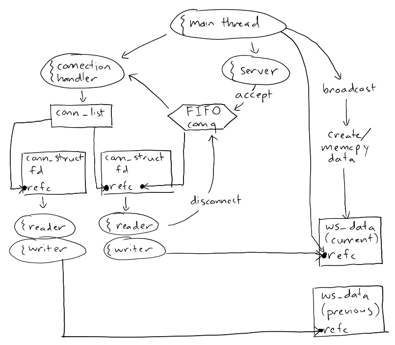

# WebSocket Ctube
`websocket_ctube` is a barebones, header-only library to enable a high
performance C/C++ program to easily share its data with webpages while actively
running (it implements a simple non-blocking WebSocket broadcast server). Modern
web technology can then be harnessed to monitor or visualize data in real-time.

Call `ws_ctube_broadcast()` to send arbitrary data to all connected browsers via
the WebSocket standard.  The main C/C++ program thread can continue to run while
the network operations are handled by `websocket_ctube` in separate threads.

Simply include `ws_ctube.h` in your project and compile with `-pthread`.

*TLS/SSL is not yet supported so the browser webpage trying to connect to
`websocket_ctube` cannot be served with https for now (this is a security
requirement imposed by the WebSocket standard)*

## Requirements
* gcc >= 4.7.0 or similar
* POSIX stuff: `pthread` and friends (aka sorry Windows)

## An example use case: heat equation visualizer
The included demo solves the heat equation PDE in a C program and displays
real-time simulation data in a browser HTML5 canvas.

Demo additionally requires `make`, `python`, and ports 9736, 9743. Run
```shell
./demo.sh
```
to compile and run, then once the server has started, open a modern :) browser
to `http://localhost:9736/example_heat_equation.html` or just the file
`example_heat_equation.html`

See `main.c`, `example_heat_equation.html` in `example_heat_equation/` for
example source code.

## Usage
```C
#include "ws_ctube.h"

struct ws_ctube *ctube = ws_ctube_open(port, max_nclient, timeout_ms, max_broadcast_fps);
/* do stuff */
ws_ctube_broadcast(ctube, data, data_size); /* broadcast once */
/* do more stuff */
ws_ctube_close(ctube);
```
Compile with `-pthread`. You can easily write your own RAII wrapper class for
C++ if desired.

On the browser side, we can read the broadcasted data with standard JavaScript:
```js
const websocket = new WebSocket("ws://localhost:9743");
websocket.binaryType = "arraybuffer";
websocket.onmessage = (event) => {
	// get data transmitted by the C/C++ program
	const data = new DataView(event.data)
	// use data...
	let x = data.getInt32(i, endianness);
	// etc...
}
```

### C API Details
```C
/**
 * ws_ctube_open - create a ws_ctube websocket server. When finished, close with
 * ws_ctube_close()
 *
 * @param port port for websocket server
 * @param max_nclient maximum number of websocket client connections allowed
 * @param timeout_ms timeout (ms) for server starting and websocket handshake
 * or 0 for no timeout
 * @param max_broadcast_fps maximum number of broadcasts per second to rate
 * limit broadcasting or 0 for no limit. For best performance, disable by
 * setting to 0 and manually rate limit broadcasts.
 *
 * @return on success, a struct ws_ctube* is returned; on failure,
 * NULL is returned
 */
struct ws_ctube *ws_ctube_open(int port, int max_nclient, int timeout_ms, double
max_broadcast_fps);

/**
 * ws_ctube_close - terminate ws_ctube server and cleanup
 */
void ws_ctube_close(struct ws_ctube *ctube);

/**
 * ws_ctube_broadcast - tries to queue data for sending to all connected
 * websocket clients.
 *
 * If max_broadcast_fps was nonzero when ws_ctube_open was called, this function
 * is rate-limited accordingly and returns failure if called too soon.
 *
 * Data is copied to an internal out-buffer, then this function returns. Actual
 * network operations will be handled internally and opaquely by separate
 * threads.
 *
 * Though non-blocking, system calls performed by this function can potentially
 * take tens of microseconds. Try not to unnecessarily call this function in
 * tight loops.
 *
 * If other threads can write to *data, get a read-lock to protect *data before
 * broadcasting. The read-lock can be released immediately once this function
 * returns.
 *
 * @param ctube the websocket ctube
 * @param data pointer to data to broadcast
 * @param data_size bytes of data
 *
 * @return 0 on success, nonzero otherwise
 */
int ws_ctube_broadcast(struct ws_ctube *ctube, const void *data, size_t
data_size);
```

## Internal Architecture
This section describes the internal workings of `websocket_ctube`. This is for
documentation purposes only and is not needed to use the API.

A picture is worth a thousand words:


When the main thread calls `ws_ctube_open()`, a server thread and connection
handler thread are created.

When a new client connects from their web browser, the server thread will
`accept()` and create a new `conn_struct` for it and queue it for WebSocket
handshaking in the FIFO work-queue `connq`. The connection handler thread will
pop from `connq` and complete the handshake (with an optional timeout). If
successful, one reader and one writer thread will be spawned for that
connection.

The reader threads listen for incoming data and respond to pings with pongs
(TODO). If a client disconnects, its reader will queue the disconnect in
`connq`. The connection handler thread will pop from `connq` and close/cleanup
that client's `conn_struct` and resources.

The writer threads are responsible for the data broadcasting. When the main
thread calls `ws_ctube_broadcast()`, a `ws_ctube_data` is created and data is
memcpy'ed into it. The main thread then wakes the writers. At this point,
`ws_ctube_broadcast()` returns and the main thread can continue.

When a writer wakes, it acquires a reference to the current `ws_ctube_data` and
sends the data to its client via data frames according to the WebSocket
standard. Having one writer per client means that clients cannot block each
other.

`ws_ctube_close()` cancels the threads and frees associated resources.
Cancelling the connection handler thread causes cancellation of all
reader/writer threads.
